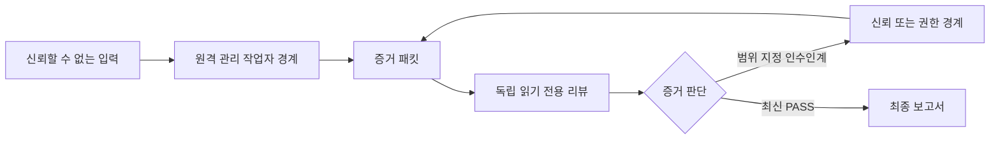
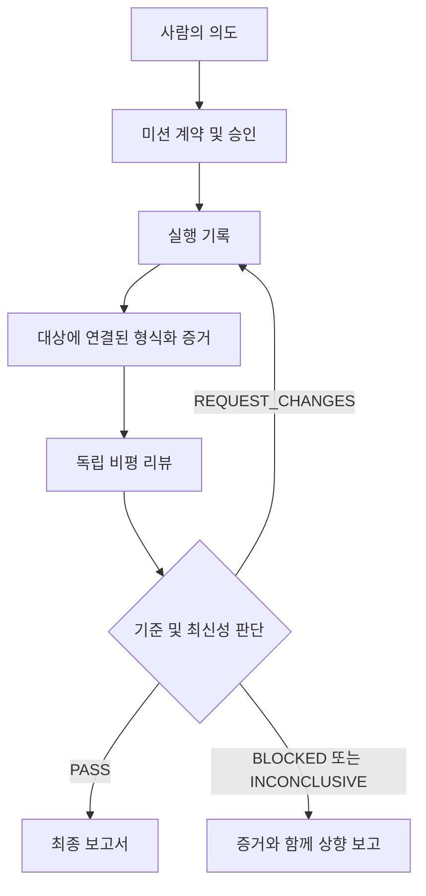

# 증거 게이트 기반 멀티 에이전트 운영

[English](README.md) / [한국어](README.ko.md)

이 저장소는 AI 지원 운영을 위한 공급업체 중립적인 증거 게이트 참조 프로토콜입니다. 에이전트 런타임, 스케줄러, 큐, 배포 서비스 또는 오케스트레이션 엔진이 아닙니다.

핵심 원칙은 단순합니다. 완료 주장은 증거가 아닙니다. 미션, 실행, 증거, 독립 리뷰 및 최종 판단을 동일한 불변 대상에 연결하고 증거가 최신인 동안에만 결과를 수용합니다.

## 신뢰 모델

일반 아키텍처에는 두 경계가 있습니다.

- **신뢰할 수 없거나 원격 관리되는 실행 경계**에는 작업자, 공개 네트워크 접근 및 조정 기능이 있을 수 있습니다. 여기서 나온 출력은 주장으로 취급합니다.
- **신뢰되거나 권한이 있는 경계**에는 비공개 파일, 자격 증명, 사용자 세션, 배포 권한 또는 프로덕션 리소스가 있을 수 있습니다. 경계를 넘을 때는 범위가 지정된 승인과 반환 증거가 필요합니다.

VPS는 첫 번째 경계의 유용한 배포 프로필일 뿐 프로토콜 요구 사항은 아닙니다. 선언된 기능과 리뷰 분리를 보존하면 어떤 공급업체, 호스트 또는 사람 프로세스에서도 역할을 수행할 수 있습니다.



## 프로토콜 v2

기계 검사 가능한 모든 YAML 문서는 `document_type`과 `schema_version: "2.0"`을 선언합니다.

| 문서 | 목적 |
| --- | --- |
| `mission_contract` | 목표, 안정적인 기준 ID, 기능, 불변 대상, 위험 및 승인 |
| `execution_record` | 프로토콜 상태, 작업자 출처, 재시도/시간 제한/멱등성, 실패, 취소 및 롤백 참조 |
| `evidence_record` | 기준 ID, 실행, 불변 대상 및 유효 기간에 연결된 형식화 증거 |
| `critic_review` | 독립 출처, 기준 판단, 판정, 발견, 필수 수정 및 수용된 연기 |
| `final_report` | 판단, 검증된 ID, 불변 대상, 출력, 잔여 위험 및 후속 작업 |

엄격한 Draft 2020-12 스키마는 [`schemas/`](schemas/)에 있습니다. JSON Schema로 표현할 수 없는 문서 간 규칙은 `egmo validate`와 `egmo judge`가 검사합니다.

`mission_id`, `criterion_id`, `execution_id`, `evidence_id`, `review_id`는 복사된 문장이 아니라 안정적인 참조입니다. 불변 대상은 Git 커밋, SHA-256 파일/OCI 다이제스트 및 형식화된 배포/리소스 리비전을 지원합니다. 변경하면 새 대상이 되며 이전 `PASS`는 승계되지 않습니다. 증거에는 수집/만료 시각이, 리뷰에는 리뷰/유효 종료 시각이 있습니다.

## 판정 및 상태 의미

| 리뷰 판정 | 의미 |
| --- | --- |
| `PASS` | 모든 적용 기준이 정확한 대상의 참조된 최신 증거로 충족되고 필수 수정이 없음 |
| `REQUEST_CHANGES` | 대상을 수정할 수 있으며 하나 이상의 필수 수정이 기록됨 |
| `BLOCKED` | 사용할 수 없는 권한, 의존성 또는 경계 접근이 필요함 |
| `INCONCLUSIVE` | 사용 가능한 증거로 통과나 구체적 수정 판단을 내릴 수 없음 |

실행 기록은 `DRAFT`, `APPROVAL_PENDING`, `APPROVED`, `RUNNING`, `EVIDENCE_PENDING`, `REVIEW_PENDING`, `PASSED`, `BLOCKED`, `CHANGES_REQUESTED`, `CANCELLED`, `PARTIAL_SUCCESS`, `ROLLBACK_PENDING`, `ROLLED_BACK`를 표현할 수 있습니다. 검증기는 순서가 지정된 허용 상태 전이, 재시도 계산, 취소/롤백 메타데이터 및 실행 상태·리뷰 판정·최종 판단의 일치를 검사합니다. 이는 프로토콜 사실이며 이 패키지는 작업을 전이하거나 예약하지 않습니다.

## 위험, 승인 및 독립성

- 낮은 위험은 명명된 정책 승인을 사용할 수 있습니다.
- 중간 위험은 실행 전에 명시적인 계약 승인이 필요합니다.
- 높은 위험 또는 프로덕션 작업은 만료되는 범위 지정 승인과 롤백/보상 계획이 필요합니다.
- 프로덕션은 항상 높은 위험으로 분류합니다.
- 높은 위험에서는 작업자와 다른 리뷰어 런타임/실행 및 읽기 전용 접근이 필수입니다.

리뷰 출처에는 리뷰어 신원, 런타임/모델, 분리된 실행 참조, 컨텍스트 출처/범위, 접근 모드, 충돌 및 읽기 전용 상태가 포함됩니다. 허용 부작용은 파일 읽기/쓰기 glob, 네트워크 도메인, 배포, 데이터베이스 변경 및 메시징 플래그로 표현합니다. 실제 강제는 주변 환경의 책임이며 프로토콜은 권한을 검사 가능하게 만듭니다.

## 형식화 증거

증거 형식은 `command_result`, `test_result`, `read_back`, `api_response`, `artifact`입니다. 명령/테스트에는 명령, 종료 상태, RFC 3339 시작/종료 시각, 환경 참조 및 불변 출력 아티팩트가 포함됩니다. API, 읽기 및 아티팩트 기록에는 URI와 다이제스트가 포함됩니다. 설명은 관련성을 보완하지만 형식화 필드를 대신하지 않습니다.

## CLI

```bash
python3 -m pip install -e .
egmo validate
egmo validate --mode tracked
egmo validate --mode history
egmo judge templates/mission.yaml templates/execution-record.yaml templates/evidence.yaml templates/critic-review.yaml templates/final-report.yaml
egmo create-task ./task-packet --mission-id example-mission-0002
```

종료 코드는 결정적입니다. `0`은 검증 통과 또는 `PASSED`, `1`은 검증/판단 미통과, `2`는 사용법·입력·운영 오류입니다. `create-task`는 프로토콜 문서만 복사하고 실행하지 않습니다.

기본적으로 `judge`는 결정적 재현을 위해 리뷰에 기록된 `reviewed_at` 시점에서 최신성을 검사합니다. 운영 환경에서는 현재 시각을 명시적인 RFC 3339 `--as-of` 값으로 전달해야 합니다. CI는 템플릿의 최신성 날짜와 별도로 하드코딩된 검사 날짜가 어긋나지 않도록 기록된 시점을 사용합니다.

## 증거 흐름



복사 가능한 문서는 [`templates/`](templates/)에 있습니다. 완전한 Markdown 체인은 [`examples/protocol-chain.md`](examples/protocol-chain.md)에, 실패 중심 예시는 [`examples/failure-cases.md`](examples/failure-cases.md)에, 적합한 연기와 판단 사례는 [`examples/case-study-001/`](examples/case-study-001/)에 있습니다.

## 검증 및 공개 안전

```bash
python3 -m pip install -r requirements-dev.txt
npm ci
python3 -m compileall -q egmo scripts tests
egmo validate --mode working-tree
egmo validate --mode tracked
egmo validate --mode history
npm test
npm run scan:secrets
npm run lint:markdown
npm run lint:mermaid
npm run smoke:package
```

패키지 스모크 게이트는 sdist와 wheel을 모두 빌드하고 각각 격리된 환경에 새로 설치한 다음 소스 체크아웃 외부에서 설치된 `egmo`를 실행합니다.

설정 가능한 [`sanitization-policy.yaml`](sanitization-policy.yaml)은 작업 트리, 추적 파일 또는 Git 이력의 문서, 스키마, 소스, 셸, JS/TS, TOML, INI, CSV 및 환경 변수 형태 텍스트를 검사합니다. 비밀 형태 할당, 비예시 이메일/주소, 비공개 POSIX/Windows 경로, 내부 호스트, 채팅 식별자, IPv4 및 IPv6를 탐지합니다. 결정적 스캐너는 심층 방어이며 CI는 고정된 표준 `detect-secrets` 스캐너도 실행합니다.

Mermaid 검증은 독립 및 인라인 다이어그램에 실제 Mermaid CLI 렌더러를 사용하며 손상된 다이어그램 거부를 회귀 테스트합니다. 링크와 모든 YAML 예시도 검증합니다.

## v1에서 마이그레이션

v2는 의도적인 호환 중단입니다. 형태 기반 Markdown 분기, 기준 문장 복사, 자유 형식 부작용/증거, 버전 없는 리뷰 및 `PASS_WITH_DEFERRALS`는 허용되지 않습니다. 문서 종류/버전을 추가하고, 안정적 ID를 배정하고, 부작용과 증거를 형식화하고, 불변 대상과 유효 기간을 추가하고, 실행 기록 및 리뷰 출처를 작성합니다. 모든 기준이 충족된 경우에만 `PASS`와 구조화된 `deferrals`를 함께 사용합니다. 역사적 보존이 필요하면 v1 아카이브를 별도로 유지합니다.

## 배포 프로필

- **VPS 우선 예시:** 원격 VPS가 조정과 신뢰할 수 없는 작업자를 호스팅하고 로컬/권한 실행자는 명시적 인수인계를 받습니다.
- **관리형 CI:** CI가 작업자 경계이고 보호 환경이 권한 경계입니다.
- **사람 중심:** 사람이 모든 역할을 수행하고 스키마를 감사 패킷으로 사용합니다.

통제와 기여 게이트는 [`THREAT_MODEL.md`](THREAT_MODEL.md), [`SECURITY.md`](SECURITY.md), [`CONTRIBUTING.md`](CONTRIBUTING.md)를 참고하십시오.

## 라이선스

Creative Commons Attribution 4.0 International 라이선스입니다. [`LICENSE`](LICENSE)를 참고하십시오.
