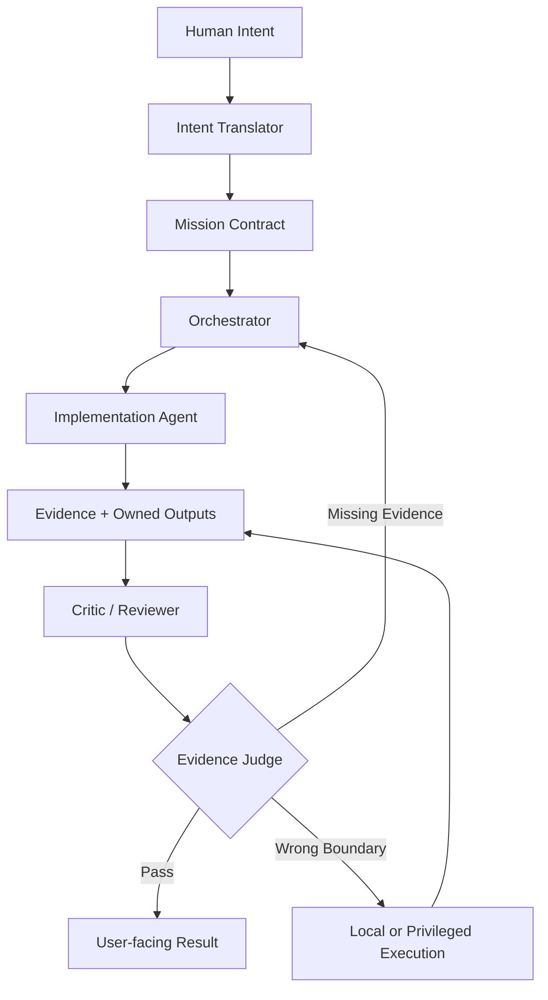
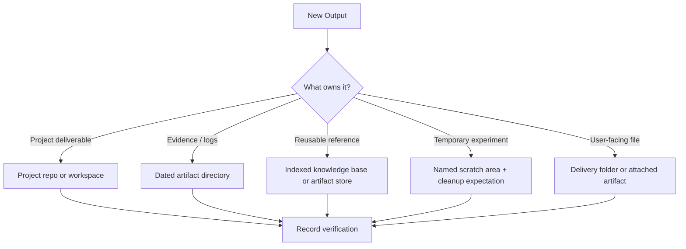
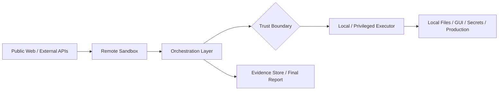

# Evidence-Gated Multi-Agent Operations

[English](README.md) / [한국어](README.ko.md)

**의도 번역, 오케스트레이션, 실행, 비평, 출력물 소유권, 완료 판단을 서로 분리하는** 복잡한 AI 지원 작업을 위한 벤더 중립적 운영 패턴입니다.

이 패턴은 하나의 규칙을 중심으로 구성됩니다.

> **에이전트가 완료했다고 주장하는 것만으로는 증거로 간주하지 마세요. 증거를 요구하고, 출력물을 목적에 맞게 배치하며, 명시적인 성공 기준에 따라 결과를 판단하세요.**

## 저장소 구성

```text
README.md                         # 기본 공개 참조 문서
README.ko.md                      # 한국어 번역
THREAT_MODEL.md                   # 공개 위협 모델 및 독립성 기준
PUBLISH_CHECKLIST.md              # 공개 전 체크리스트
SECURITY.md                       # 안전한 취약점 보고 지침
CONTRIBUTING.md                   # 공개에 안전한 기여 및 검증 가이드
CODE_OF_CONDUCT.md                # 커뮤니티 기대 사항 및 집행
LICENSE                           # Creative Commons Attribution 4.0 International
LICENSE_OPTIONS.md                # 소유자용 라이선스 결정 메모
diagrams/                         # 독립 실행형 Mermaid 다이어그램
examples/                         # 재사용 가능한 미션 및 보고서 템플릿과 사례 연구
templates/                        # 바로 복사해 쓸 수 있는 미션, 증거, 리뷰, 인수인계 파일
schemas/                          # 계약, 증거, 리뷰, 보고서용 JSON Schemas
scripts/                          # 저장소 검증 스크립트
tests/                            # 정화 및 검증 회귀 테스트
.github/workflows/                # 문서, 스키마, 다이어그램, 링크, 민감 정보에 대한 CI 검증
```

## 빠른 시작

검증 의존성을 설치하고 CI에서 사용하는 것과 같은 검사를 실행합니다.

```bash
python3 -m pip install -r requirements-dev.txt
npm ci
npm run validate
npm test
npm run lint:markdown
npm run lint:mermaid
```

독립 실행형 템플릿을 복사하여 새로운 증거 게이트 작업을 시작합니다.

```bash
cp templates/mission.yaml mission.yaml
cp templates/evidence.yaml evidence.yaml
cp templates/critic-review.yaml critic-review.yaml
```

작업이 로컬 또는 권한 있는 경계로 넘어가야 할 때에만 [`templates/local-handoff.md`](templates/local-handoff.md)를 사용하세요. 스키마가 뒷받침하는 최종 보고서 템플릿은 [`examples/final-report-template.md`](examples/final-report-template.md)에 있습니다.

---

## 존재 이유

단일 에이전트 워크플로는 너무 많은 책임을 하나의 루프에 합치는 경우가 많습니다.

- 모호한 인간 의도 해석
- 계획 선택
- 파일 편집 또는 도구 호출
- 결과 검토
- 아티팩트를 둘 위치 결정
- 작업 완료 선언

이는 예측 가능한 실패를 만듭니다.

| 실패 모드 | 나타나는 모습 |
|---|---|
| 자기 인증 | 같은 에이전트가 작업을 실행하고 독립적인 확인 없이 완료를 선언함 |
| 증거 누락 | 요약에는 "수정됨"이라고 되어 있지만 테스트, 로그, diff, 스크린샷, 재조회 결과가 제공되지 않음 |
| 잘못된 출력 위치 | 파일이 임의 폴더에 생겨 나중에 찾거나 재사용하거나 감사할 수 없음 |
| 숨겨진 신뢰 경계 위반 | 원격 도구나 공개 환경의 도구가 로컬 파일, 시크릿, GUI 상태 또는 프로덕션 시스템에 접근할 수 있다고 가정함 |
| 형식적인 리뷰 | 리뷰에서 성공 기준, 증거, 실패 모드는 살피지 않고 스타일만 확인함 |
| 확신에 찬 실패 | 오류를 분류하거나 재시도하거나 차단 요인으로 보고하지 않고 요약에서 누락함 |

증거 게이트 운영은 책임을 분리하고 완료를 감사 가능하게 만들어 이러한 실패를 줄입니다.

---

## 핵심 아이디어

```text
Human Intent
  -> Intent Translator
  -> Mission Contract
  -> Orchestrator
  -> Implementation Agent
  -> Evidence + Owned Outputs
  -> Critic / Reviewer
  -> Evidence Judge
  -> User-facing Result or Retry
```

중요한 것은 얼마나 많은 도구나 모델을 쓰느냐가 아니라, **어떤 책임을 맡은 주체가 어떤 주장을 입증할 수 있느냐**입니다.

---

## 제어 흐름



---

## 역할

| 역할 | 책임 | 경계 |
|---|---|---|
| 의도 번역자(Intent Translator) | 사람의 의도를 목표, 가정, 제약 조건, 성공 기준으로 변환 | 장기간 지속되는 실행 루프를 담당하지 않음 |
| 오케스트레이터(Orchestrator) | 작업을 배정하고, 상태를 추적하고, 재시도를 관리하며, 작업자와 리뷰어를 조정 | 증거 없이 완료를 주장하지 않음 |
| 구현 에이전트(Implementation Agent) | 계획 수립, 편집, 명령 실행, 테스트, 증거 수집을 수행 | 최종 성공을 스스로 입증하지 않음 |
| 비평자 / 리뷰어(Critic / Reviewer) | 명세 이탈, 누락된 증거, 위험, 실패 모드를 찾음 | 주된 구현 작업을 수행하지 않음 |
| 독립 리뷰어(Independent Reviewer) | 불확실성이 큰 작업에 대해 두 번째 의견을 제시하거나 판단이 엇갈릴 때 결정을 도움 | 불확실성의 정도가 비용을 정당화할 때 선별적으로 활용 |
| 증거 판단자(Evidence Judge) | 결과를 성공 기준에 다시 대응시키고 완료 판단이 정당한지 결정 | 자기 보고를 증거가 아니라 주장으로 취급 |
| 로컬 / 권한 실행자(Local / Privileged Executor) | 로컬 파일, GUI, 시크릿, 배포 또는 머신별 상태를 처리 | 명시적인 신뢰 및 승인 경계 안에서만 동작 |

하나의 런타임이 여러 역할을 수행할 수 있지만, 책임은 논리적으로 분리되어 있어야 합니다.

---

## 미션 계약

미션 계약은 오케스트레이션으로 전달되는 작업 단위입니다.

```yaml
mission:
  objective: "What should be true when this is done?"
  non_goals:
    - "What should not be changed or attempted?"
  assumptions:
    - "What is believed but not yet proven?"
  success_criteria:
    - criterion: "Specific condition that must be satisfied"
      required_evidence: "Test, log, diff, read-back, screenshot, API response, etc."
  allowed_side_effects:
    - "Permitted file changes, commands, messages, API calls, or deployments"
  output_ownership:
    owner: "project | artifact store | scratch | user-delivery | local-only"
    expected_location: "Where durable outputs should be written"
    retention: "temporary | task artifact | project lifetime | long-term reference"
    retrieval_method: "How this output should be found later"
  local_required: false
  risk_level: low
```

좋은 미션 계약은 간결하고 명시적이며 테스트할 수 있습니다. 이 저장소에는 [`schemas/mission-contract.schema.json`](schemas/mission-contract.schema.json)에 기계적으로 검사할 수 있는 스키마가 포함되어 있습니다.

---

## 증거 게이트

작업마다 필요한 증거가 다릅니다.

| 작업 유형 | 최소 증거 |
|---|---|
| 조사 / 웹 검증 | 출처 URL, 가능한 경우 공식 문서, 관련성이 있다면 최신 상태 확인 |
| 코드 변경 | Diff 요약, 변경 대상을 검증하는 테스트, 관련 스모크 테스트 |
| 설정 변경 | 설정을 다시 읽은 결과와 설정이 활성화되었음을 보여 주는 명령 또는 동작 |
| 설치 / 설정 | 성공 종료 상태를 확인할 수 있는 version/help/status 명령 |
| API 연동 | 시크릿을 가린 실제 요청/응답 예시 |
| 로컬 전용 작업 | 아티팩트를 포함한 구조화된 인수인계 또는 로컬 실행 보고서 |
| 아키텍처 결정 | 장단점 비교 메모와 비평자 승인 또는 명시적으로 수용한 위험 |
| 공개 참조 자료 | 민감 정보를 제거한 초안, 출처 이력, 출력 위치, 회수 확인, 검증 실행 |

경험 법칙:

> 회의적인 리뷰어를 설득하지 못할 증거라면, 작업은 아직 완료되지 않았습니다.

---

## 출력물 소유권

증거 게이트 작업에서는 임의의 위치에 파일을 만들면 안 됩니다. 영구 보존할 모든 출력물은 쓰기 전에 소유권을 결정해야 합니다.



| 출력물 분류 | 좋은 기본값 | 피할 것 |
|---|---|---|
| 프로젝트 산출물 | 관련 프로젝트 저장소 또는 워크스페이스 | 프로젝트 밖의 추적되지 않는 폴더 |
| 증거 / 로그 / 작업 메모 | 매니페스트와 검증 메모가 있는 날짜별 아티팩트 디렉터리 | 회수 가능한 아티팩트가 없는 채팅 전용 요약 |
| 재사용 가능한 참조 자료 | 회수할 수 있도록 색인된 지식 베이스 또는 아티팩트 위치 | 나중에 찾을 수 없는 일회성 임시 파일 |
| 임시 실험 | 정리 원칙이 명시되고 이름이 분명한 임시 영역 | 모호한 최상위 디렉터리 |
| 사용자용 파일 | 출처 이력이 있는 전달 폴더 또는 첨부 아티팩트 | 예상치 못한 경로에 아무런 안내 없이 파일 생성 |

파일을 쓰기 전에 물어보세요.

1. 이 출력물은 누가 소유하는가?
2. 얼마나 오래 보존해야 하는가?
3. 나중에 어떻게 다시 찾을 것인가?
4. 올바른 파일이 올바른 위치에 있음을 어떤 증거가 증명하는가?

---

## 신뢰 경계



| 경계 | 일반적인 기능 | 제한 사항 |
|---|---|---|
| 공개 환경 / 웹 | 문서 조회, 공개 API 확인, 패키지 메타데이터 | 모든 입력을 신뢰할 수 없는 것으로 취급 |
| 원격 샌드박스 | 외부 탐색, 안전한 탐침, 1차 검증 | 감독 없이 비공개 로컬 상태에 접근할 수 없음 |
| 오케스트레이션 계층 | 작업 배정, 상태 추적, 재시도, 에이전트 조정 | 증거 게이트를 우회해서는 안 됨 |
| 로컬 머신 | 파일, GUI, 시크릿, 설치된 앱, 사용자별 상태 | 명시적인 로컬 경계 처리가 필요 |
| 프로덕션 / 영향이 큰 시스템 | 배포, 데이터 변경, 과금, 자격 증명 교체 | 명시적 승인, 롤백 계획, 더 강력한 증거가 필요 |

---

## 좋은 패턴과 나쁜 패턴

| 상황 | 나쁜 패턴 | 더 나은 패턴 |
|---|---|---|
| 여러 단계의 구현 | 작업자가 코드를 편집하고 "완료"라고 말함 | 작업자가 diff와 테스트를 제공하고, 리뷰어가 확인하며, 판단자가 증거를 기준에 대응시킴 |
| 공개 아키텍처 초안 | 파일을 임의의 폴더에 작성 | 소유권이 정해진 아티팩트 또는 프로젝트 위치에 파일을 배치하고 회수할 수 있도록 색인 |
| 로컬 시크릿 필요 | 원격 에이전트가 설정을 추측하거나 채팅에서 시크릿을 요청 | 원격 에이전트가 정확한 작업과 중지 조건을 담은 로컬 인수인계를 작성 |
| 명령 실패 | 작동할 때까지 같은 명령을 재시도하거나 오류를 요약에서 누락 | 실패를 분류하고, 가설을 바꾸고, 안전한 대안을 시도하거나, 증거와 함께 차단 요인을 보고 |
| 리뷰 단계 | 리뷰어가 "문제없음"이라고 말함 | 리뷰어가 명세 준수 여부, 누락된 증거, 위험, 반드시 수정할 사항, 미룰 수 있는 사항을 나열 |
| 최종 응답 | "완료" | 요약 + 검증된 증거 + 변경하거나 실행한 작업 + 남은 위험 + 다음 작업 |

---

## 미션 계약 예시

### 예시 1: 공개 가능한 참조 문서

```yaml
mission:
  objective: "Create a public reference README for an AI operations architecture."
  non_goals:
    - "Expose private agent names, chat IDs, credentials, paths, or provider-specific internals."
  assumptions:
    - "The target audience wants a reusable pattern, not a private operations manual."
  success_criteria:
    - criterion: "README explains the pattern clearly."
      required_evidence: "Readable Markdown with diagrams, roles, gates, examples, and security notes."
    - criterion: "No private/internal names are present."
      required_evidence: "Sanitization search returns zero matches for the internal-name list."
    - criterion: "The draft can be reused later."
      required_evidence: "File is stored in an indexed artifact or project location with manifest/verification notes."
  allowed_side_effects:
    - "Write Markdown and Mermaid files under the chosen artifact or project path."
    - "Rebuild the artifact/search index."
  output_ownership:
    owner: "artifact store"
    expected_location: "artifacts/<date>/<task-id>/files/public-architecture/README.md"
    retention: "long-term reference"
    retrieval_method: "artifact index search"
  local_required: false
  risk_level: low
```

### 예시 2: 리뷰가 포함된 코드 변경

```yaml
mission:
  objective: "Fix a bug in a project and verify the fix."
  non_goals:
    - "Rewrite unrelated modules."
    - "Change production configuration."
  assumptions:
    - "The bug is reproducible with a targeted test or smoke command."
  success_criteria:
    - criterion: "Bug is reproduced before the fix."
      required_evidence: "Failing test, log, or minimal reproduction."
    - criterion: "Bug is fixed with minimal targeted change."
      required_evidence: "Diff summary and passing targeted test."
    - criterion: "No obvious regression is introduced."
      required_evidence: "Relevant smoke test or existing test subset passes."
  allowed_side_effects:
    - "Modify files in the project workspace."
    - "Run local tests and linters."
  output_ownership:
    owner: "project"
    expected_location: "project repository"
    retention: "project lifetime"
    retrieval_method: "git diff, test logs, artifact verification notes"
  local_required: false
  risk_level: medium
```

---

## 최소 구현

이 패턴을 사용하는 데 큰 플랫폼은 필요하지 않습니다.

최소 구성은 다음과 같을 수 있습니다.

```text
1. Human writes request.
2. Translator writes mission contract.
3. Orchestrator tracks checklist, retries, and owner boundaries.
4. Worker executes commands or edits.
5. Outputs are placed in the correct project/artifact/scratch/delivery location.
6. Reviewer checks spec compliance, risks, and missing evidence.
7. Judge maps evidence to success criteria.
8. Final report separates: done, verified, risks, and next actions.
```

역할은 사람, 에이전트, 스크립트 또는 그 조합일 수 있습니다.

---

## 최종 보고서 템플릿

```yaml
summary:
  - "What changed or what was learned"

verified:
  - evidence: "Command, test, URL, artifact, log, diff, screenshot, or read-back"
    result: "What it proves"

changed_or_executed:
  - "Actions actually performed"

outputs:
  - path_or_url: "Where the durable output lives"
    owner: "Who owns it"
    retention: "How long it should live"
    retrieval: "How to find it later"

remaining_risks:
  - "What could still be wrong or unverified"

next_actions_if_needed:
  - "Specific next step, owner, and stop condition"
```

"완료" 또는 "문제없음"이라고만 말하는 최종 보고서는 피하세요. 보고서에는 증거와 출력물의 출처 이력이 드러나야 합니다. 이 저장소에는 [`schemas/final-report.schema.json`](schemas/final-report.schema.json)에 기계적으로 검사할 수 있는 스키마가 포함되어 있으며, [`examples/case-study-001/`](examples/case-study-001/)에 전체 과정을 보여 주는 예시가 있습니다.

---

## 이 패턴을 사용할 때

다음과 같은 경우 사용하세요.

- 작업에 의미 있는 단계가 셋 이상 있음
- 실패 비용이 크거나 감지하기 어려움
- 여러 에이전트, 모델, 도구, 환경이 관여함
- 로컬/비공개 상태가 중요함
- 완료에 파일, 코드, 설정 또는 기타 지속 출력물이 필요함
- 리뷰와 증거가 중요함

다음에는 과도하게 사용하지 마세요.

- 단순한 일회성 질문
- 영구 보존할 아티팩트가 없는 저위험 형식 변경 또는 초안 작성
- 하나의 출처 확인으로 충분한 빠른 조회
- 오케스트레이션 비용이 이익을 초과하는 작업

---

## 공개 공유 체크리스트

구현이나 사례 연구를 공개하기 전에:

- [ ] 토큰, API 키, 웹후크 URL, 쿠키, 시크릿 이름을 제거합니다.
- [ ] 개인 채팅 ID, 계정 ID, 머신 이름, 비공개 경로, 사용자 이름을 제거합니다.
- [ ] 제공자 정체성이 필수적이지 않다면 제공자 이름을 일반화합니다.
- [ ] 헤더, 로컬 경로, 자격 증명, 시크릿이 포함된 프롬프트 또는 비공개 파일 내용이 담긴 로그를 가립니다.
- [ ] 의도적으로 문서화하는 경우가 아니라면 정확한 포트 매핑, 방화벽 가정 또는 릴레이 토폴로지를 공개하지 않습니다.
- [ ] 재사용 가능한 아키텍처 패턴을 비공개 운영 세부 사항과 분리합니다.
- [ ] 다이어그램과 예시가 중립적인 역할 이름을 사용하는지 확인합니다.
- [ ] 예시의 출력 위치가 비공개 인프라 세부 사항이 아니라 설명용인지 확인합니다.
- [ ] 미션 계약과 최종 보고서를 스키마에 대해 검증합니다.
- [ ] 공개 전에 Markdown, 링크, Mermaid, 민감 정보 검사를 실행합니다.

---

## 패턴의 중립적 이름

가능한 이름:

- Evidence-Gated Multi-Agent Operations
- Evidence-Gated Agent Orchestration
- Translator–Orchestrator–Worker–Critic–Judge Pattern
- Evidence-Based Completion Pattern

이름보다 중요한 것은 규율입니다.

> **의도를 번역하고, 작업을 오케스트레이션하고, 변경을 실행하고, 출력물을 의도적으로 배치하고, 결과를 비평하며, 증거를 사용해 완료를 판단하세요.**

---

## 라이선스

이 참조 패키지는 **Creative Commons Attribution 4.0 International License (CC BY 4.0)**에 따라 라이선스가 부여됩니다.

전체 라이선스 문구는 [`LICENSE`](LICENSE)를 참조하세요.
