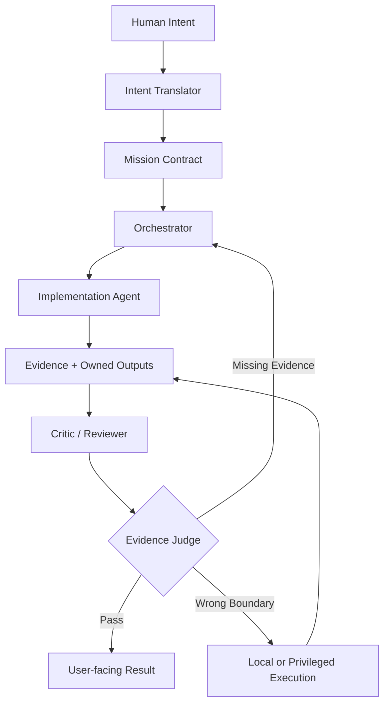
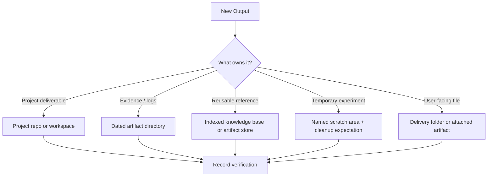
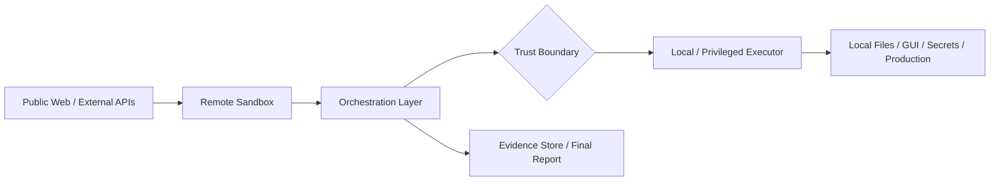

# Evidence-Gated Multi-Agent Operations

A vendor-neutral operating pattern for complex AI-assisted work where **intent translation, orchestration, execution, critique, output ownership, and completion judgment are separated**.

The pattern is built around one rule:

> **Do not treat an agent's completion claim as proof. Require evidence, place outputs deliberately, and judge the result against explicit success criteria.**

## Repository contents

```text
README.md                         # Main public reference
THREAT_MODEL.md                   # Public threat model and independence criteria
PUBLISH_CHECKLIST.md              # Pre-publication checklist
LICENSE                           # Creative Commons Attribution 4.0 International
LICENSE_OPTIONS.md                # Owner-facing license decision notes
diagrams/                         # Standalone Mermaid diagrams
examples/                         # Reusable mission/report templates and case studies
schemas/                          # JSON Schemas for mission contracts and final reports
scripts/                          # Repository validation scripts
.github/workflows/                # CI validation for docs, schemas, diagrams, links, and sanitization
```

---

## Why this exists

Single-agent workflows often collapse too many responsibilities into one loop:

- interpreting ambiguous human intent
- choosing the plan
- editing files or calling tools
- reviewing the result
- deciding where artifacts should live
- declaring the task complete

That creates predictable failures:

| Failure Mode | What it looks like |
|---|---|
| Self-certification | The same agent executes the work and declares it done without independent checks |
| Missing evidence | Summaries say "fixed" but no tests, logs, diffs, screenshots, or read-backs are provided |
| Wrong output location | Files appear in arbitrary folders and cannot be found, reused, or audited later |
| Hidden trust-boundary violation | Remote or public-side tools assume access to local files, secrets, GUI state, or production systems |
| Rubber-stamp review | Review checks style but not success criteria, evidence, or failure modes |
| Confident failure | Errors are summarized away instead of classified, retried, or reported as blockers |

Evidence-gated operations reduce these failures by separating duties and making completion auditable.

---

## Core idea

```text
Human Intent
  -> Intent Translator
  -> Mission Contract
  -> Orchestrator
  -> Implementation Agent
  -> Evidence + Owned Outputs
  -> Critic / Reviewer
  -> Evidence Judge
  -> User-facing Result or Retry
```

The important separation is not about how many tools or models you use. It is about **which responsibility is allowed to certify which claim**.

---

## Control flow



---

## Roles

| Role | Responsibility | Boundary |
|---|---|---|
| Intent Translator | Converts human intent into objective, assumptions, constraints, and success criteria | Does not own long-running execution loops |
| Orchestrator | Routes work, tracks state, manages retries, and coordinates workers/reviewers | Does not claim completion without evidence |
| Implementation Agent | Plans, edits, runs commands, tests, and gathers evidence | Does not self-certify final success |
| Critic / Reviewer | Looks for spec drift, missing evidence, risks, and failure modes | Does not perform the primary implementation |
| Independent Reviewer | Provides a second opinion or tie-break on high-uncertainty work | Used selectively when the uncertainty justifies cost |
| Evidence Judge | Maps results back to success criteria and decides whether completion is justified | Treats self-reports as claims, not proof |
| Local / Privileged Executor | Handles local files, GUI, secrets, deployments, or machine-specific state | Stays behind an explicit trust and approval boundary |

A single runtime can perform multiple roles, but the responsibilities should remain logically separate.

---

## Mission contract

A mission contract is the work unit passed into orchestration.

```yaml
mission:
  objective: "What should be true when this is done?"
  non_goals:
    - "What should not be changed or attempted?"
  assumptions:
    - "What is believed but not yet proven?"
  success_criteria:
    - criterion: "Specific condition that must be satisfied"
      required_evidence: "Test, log, diff, read-back, screenshot, API response, etc."
  allowed_side_effects:
    - "Permitted file changes, commands, messages, API calls, or deployments"
  output_ownership:
    owner: "project | artifact store | scratch | user-delivery | local-only"
    expected_location: "Where durable outputs should be written"
    retention: "temporary | task artifact | project lifetime | long-term reference"
    retrieval_method: "How this output should be found later"
  local_required: false
  risk_level: low
```

Good mission contracts are compact, explicit, and testable. The repository includes a machine-checkable schema at [`schemas/mission-contract.schema.json`](schemas/mission-contract.schema.json).

---

## Evidence gates

Different tasks require different proof.

| Task type | Minimum evidence |
|---|---|
| Research / web validation | Source URLs, official docs when possible, and current checks when relevant |
| Code change | Diff summary, targeted tests, and relevant smoke test |
| Config change | Read-back of config plus command or behavior showing it is active |
| Install / setup | Version/help/status command with successful exit status |
| API integration | Live request/response sample with secrets redacted |
| Local-only task | Structured handoff or local execution report with artifacts |
| Architecture decision | Tradeoff memo plus critic pass or explicitly accepted risks |
| Public reference material | Sanitized draft, provenance, output location, retrieval check, and validation run |

Rule of thumb:

> If the evidence would not convince a skeptical reviewer, the task is not done yet.

---

## Output ownership

Evidence-gated work should not create files in arbitrary locations. Every durable output needs an ownership decision before it is written.



| Output class | Good default | Avoid |
|---|---|---|
| Project deliverable | Relevant project repository or workspace | Untracked folders outside the project |
| Evidence / logs / task notes | Dated artifact directory with manifest and verification notes | Chat-only summaries with no retrievable artifact |
| Reusable reference material | Knowledge base or artifact location indexed for retrieval | One-off scratch files that cannot be found later |
| Temporary experiment | Clearly named scratch area with cleanup expectations | Ambiguous top-level directories |
| User-facing file | Delivery folder or attached artifact with provenance | Silent file creation in an unexpected path |

Before writing a file, ask:

1. Who owns this output?
2. How long should it live?
3. How will it be found again?
4. What evidence proves it is the right file in the right place?

---

## Trust boundaries



| Boundary | Typical capabilities | Restrictions |
|---|---|---|
| Public / Web | Documentation lookup, public API checks, package metadata | Treat all input as untrusted |
| Remote Sandbox | External discovery, safe probes, first-pass validation | No unsupervised access to private local state |
| Orchestration Layer | Routing, state tracking, retries, agent coordination | Should not bypass evidence gates |
| Local Machine | Files, GUI, secrets, installed apps, user-specific state | Requires explicit local boundary handling |
| Production / High-impact Systems | Deployment, data mutation, billing, credential rotation | Requires explicit approval, rollback plan, and stronger evidence |

---

## Good vs bad patterns

| Situation | Bad pattern | Better pattern |
|---|---|---|
| Multi-step implementation | Worker edits code, says "done" | Worker provides diff + tests; reviewer checks; judge maps evidence to criteria |
| Public architecture draft | File is written to a random folder | File is placed in an owned artifact/project location and indexed for retrieval |
| Local secret needed | Remote agent guesses config or asks for secrets in chat | Remote agent produces a local handoff with exact actions and stop condition |
| Failed command | Retry the same command until it works or summarize away the error | Classify failure, change hypothesis, try safe alternative, or report blocker with evidence |
| Review step | Reviewer says "looks good" | Reviewer lists spec compliance, missing evidence, risks, must-fix, can-defer |
| Final response | "Completed" | Summary + verified evidence + changed/executed actions + remaining risks + next actions |

---

## Example mission contracts

### Example 1: Publishable reference document

```yaml
mission:
  objective: "Create a public reference README for an AI operations architecture."
  non_goals:
    - "Expose private agent names, chat IDs, credentials, paths, or provider-specific internals."
  assumptions:
    - "The target audience wants a reusable pattern, not a private operations manual."
  success_criteria:
    - criterion: "README explains the pattern clearly."
      required_evidence: "Readable Markdown with diagrams, roles, gates, examples, and security notes."
    - criterion: "No private/internal names are present."
      required_evidence: "Sanitization search returns zero matches for the internal-name list."
    - criterion: "The draft can be reused later."
      required_evidence: "File is stored in an indexed artifact or project location with manifest/verification notes."
  allowed_side_effects:
    - "Write Markdown and Mermaid files under the chosen artifact or project path."
    - "Rebuild the artifact/search index."
  output_ownership:
    owner: "artifact store"
    expected_location: "artifacts/<date>/<task-id>/files/public-architecture/README.md"
    retention: "long-term reference"
    retrieval_method: "artifact index search"
  local_required: false
  risk_level: low
```

### Example 2: Code change with review

```yaml
mission:
  objective: "Fix a bug in a project and verify the fix."
  non_goals:
    - "Rewrite unrelated modules."
    - "Change production configuration."
  assumptions:
    - "The bug is reproducible with a targeted test or smoke command."
  success_criteria:
    - criterion: "Bug is reproduced before the fix."
      required_evidence: "Failing test, log, or minimal reproduction."
    - criterion: "Bug is fixed with minimal targeted change."
      required_evidence: "Diff summary and passing targeted test."
    - criterion: "No obvious regression is introduced."
      required_evidence: "Relevant smoke test or existing test subset passes."
  allowed_side_effects:
    - "Modify files in the project workspace."
    - "Run local tests and linters."
  output_ownership:
    owner: "project"
    expected_location: "project repository"
    retention: "project lifetime"
    retrieval_method: "git diff, test logs, artifact verification notes"
  local_required: false
  risk_level: medium
```

---

## Minimal implementation

You do not need a large platform to use the pattern.

A minimal setup can be:

```text
1. Human writes request.
2. Translator writes mission contract.
3. Orchestrator tracks checklist, retries, and owner boundaries.
4. Worker executes commands or edits.
5. Outputs are placed in the correct project/artifact/scratch/delivery location.
6. Reviewer checks spec compliance, risks, and missing evidence.
7. Judge maps evidence to success criteria.
8. Final report separates: done, verified, risks, and next actions.
```

The roles can be humans, agents, scripts, or a mix.

---

## Final report template

```yaml
summary:
  - "What changed or what was learned"

verified:
  - evidence: "Command, test, URL, artifact, log, diff, screenshot, or read-back"
    result: "What it proves"

changed_or_executed:
  - "Actions actually performed"

outputs:
  - path_or_url: "Where the durable output lives"
    owner: "Who owns it"
    retention: "How long it should live"
    retrieval: "How to find it later"

remaining_risks:
  - "What could still be wrong or unverified"

next_actions_if_needed:
  - "Specific next step, owner, and stop condition"
```

Avoid final reports that only say "done" or "looks good." The report should expose evidence and output provenance. The repository includes a machine-checkable schema at [`schemas/final-report.schema.json`](schemas/final-report.schema.json) and an end-to-end example in [`examples/case-study-001/`](examples/case-study-001/).

---

## When to use this pattern

Use it when:

- the task has three or more meaningful steps
- failure would be costly or hard to detect
- multiple agents, models, tools, or environments are involved
- local/private state matters
- completion requires files, code, configuration, or other durable outputs
- review and evidence are important

Do not overuse it for:

- simple one-shot questions
- low-risk formatting or drafting tasks with no durable artifact
- quick lookups where one source check is enough
- tasks where orchestration overhead exceeds the benefit

---

## Public sharing checklist

Before publishing an implementation or case study:

- [ ] Remove tokens, API keys, webhook URLs, cookies, and secret names.
- [ ] Remove personal chat IDs, account IDs, machine names, private paths, and usernames.
- [ ] Generalize provider names if provider identity is not essential.
- [ ] Redact logs that include headers, local paths, credentials, prompts containing secrets, or private file contents.
- [ ] Avoid publishing exact port mappings, firewall assumptions, or relay topology unless intentionally documented.
- [ ] Separate the reusable architectural pattern from private operational details.
- [ ] Confirm diagrams and examples use neutral role names.
- [ ] Confirm output locations in examples are illustrative, not private infrastructure details.
- [ ] Validate mission contracts and final reports against the schemas.
- [ ] Run Markdown, link, Mermaid, and sanitization checks before publishing.

---

## Neutral names for the pattern

Possible names:

- Evidence-Gated Multi-Agent Operations
- Evidence-Gated Agent Orchestration
- Translator–Orchestrator–Worker–Critic–Judge Pattern
- Evidence-Based Completion Pattern

The name matters less than the discipline:

> **Translate intent, orchestrate work, execute changes, place outputs deliberately, critique results, and judge completion using evidence.**

---

## License

This reference package is licensed under the **Creative Commons Attribution 4.0 International License (CC BY 4.0)**.

See [`LICENSE`](LICENSE) for the full license text.
