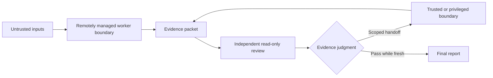
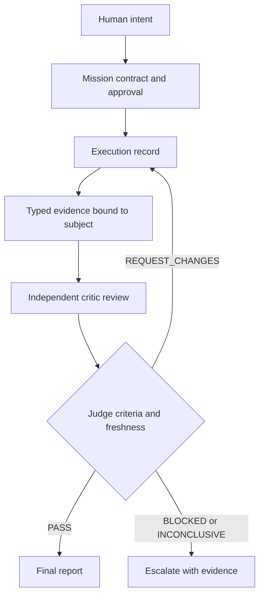

# Evidence-Gated Multi-Agent Operations

[English](README.md) / [한국어](README.ko.md)

This repository is a vendor-neutral reference protocol for evidence-gated AI-assisted operations. It is not an agent runtime, scheduler, queue, deployment service, or orchestration engine.

The core rule is simple: a completion claim is not proof. Bind a mission, execution, evidence, independent review, and final judgment to the same immutable subject, then accept the outcome only while that evidence remains fresh.

## Trust model

The general architecture has two boundaries:

- An **untrusted or remotely managed execution boundary** may host workers, public-network access, and coordination. Its output is treated as a claim.
- A **trusted or privileged boundary** may hold private files, credentials, user sessions, deployment authority, or production resources. Crossing it requires scoped approval and returned evidence.

A virtual private server (VPS) is one useful deployment profile for the first boundary, not a protocol requirement. Roles may run on any vendor, host, or human process that preserves the declared capabilities and review separation.


```mermaid
flowchart LR
    A[Untrusted inputs] --> B[Remotely managed worker boundary]
    B --> C[Evidence packet]
    C --> D[Independent read-only review]
    D --> E{Evidence judgment}
    E -->|Scoped handoff| F[Trusted or privileged boundary]
    F --> C
    E -->|Pass while fresh| G[Final report]
```

## Protocol v2

Every machine-checkable YAML document declares `document_type` and `schema_version: "2.0"`. The supported types are:

| Document | Purpose |
| --- | --- |
| `mission_contract` | Objective, stable criterion IDs, capabilities, immutable target, risk, and approval |
| `execution_record` | Protocol state, worker provenance, retry/timeout/idempotency, failure, cancellation, and rollback references |
| `evidence_record` | Typed evidence bound to criterion IDs, execution, immutable subject, and freshness window |
| `critic_review` | Independent provenance, criterion decisions, verdict, findings, fixes, and accepted deferrals |
| `final_report` | Judgment, verified IDs, immutable subject, outputs, residual risks, and next actions |

The schemas are strict Draft 2020-12 JSON Schemas under [`schemas/`](schemas/). Cross-document rules that JSON Schema cannot express are enforced by `egmo validate` and `egmo judge`.

Stable IDs are references, not copied prose: `mission_id`, `criterion_id`, `execution_id`, `evidence_id`, and `review_id`. Immutable subjects support Git commit IDs, SHA-256 file or OCI digests, and typed deployment/resource revisions. A mutation produces a new subject; an earlier `PASS` does not transfer to it. Evidence has `captured_at` and `expires_at`, while a review has `reviewed_at` and `valid_until`.

## Verdict and state semantics

| Review verdict | Meaning |
| --- | --- |
| `PASS` | Every applicable criterion is satisfied by referenced, fresh evidence for the exact subject; no must-fix item remains |
| `REQUEST_CHANGES` | The subject can be corrected; at least one must-fix item is recorded |
| `BLOCKED` | Progress requires unavailable authority, dependency, or boundary access |
| `INCONCLUSIVE` | Available evidence cannot support either pass or a specific correction |

Execution records can represent `DRAFT`, `APPROVAL_PENDING`, `APPROVED`, `RUNNING`, `EVIDENCE_PENDING`, `REVIEW_PENDING`, `PASSED`, `BLOCKED`, `CHANGES_REQUESTED`, `CANCELLED`, `PARTIAL_SUCCESS`, `ROLLBACK_PENDING`, and `ROLLED_BACK`. The validator checks ordered, allowed state transitions, retry accounting, cancellation/rollback metadata, and agreement among execution state, review verdict, and final judgment. These are protocol facts only; this package does not transition or schedule work.

## Risk, approval, and independence

- Low risk may use a named policy approval.
- Medium risk requires explicit contract approval before execution.
- High-risk or production work requires explicit scoped approval with expiry and a rollback or compensation plan.
- Production is always classified high risk.
- Medium and high risk require a reviewer runtime and review execution distinct from the worker and worker execution. Review access must set `read_only: true`; `access_mode` may be live `read_only` or an immutable `offline_packet`, while `read_write` is rejected.
- Low risk may retain policy-based or logical reviewer separation, but must still disclose reviewer provenance.

Reviewer provenance records reviewer identity, runtime/model references, separate execution references, context sources and scope, access mode, conflicts, and read-only status. The validator checks the medium/high independence rule across the mission, execution, and review records; it remains a protocol validator and does not launch or isolate reviewers.

An `offline_packet` exposes no live writable surface, so the protocol treats an immutable packet as at least as isolated as live read-only review. The validator requires the accompanying `read_only` claim but cannot establish packet immutability or enforce runtime access; the surrounding review system must provide and attest those controls.

Allowed side effects are capabilities rather than prose: filesystem read/write globs, network domains, and deployment, database-mutation, and messaging flags. Enforcement belongs to the surrounding environment; the protocol makes the grant inspectable.

## Typed evidence

Evidence types are `command_result`, `test_result`, `read_back`, `api_response`, and `artifact`. Command/test records include the command, exit status, RFC 3339 start/end times, environment reference, and immutable output artifact. API, read-back, and artifact records carry a source/artifact URI and digest. Bounded descriptions explain relevance but never replace typed fields.

## CLI

Install and use the small validation package:

```bash
python3 -m pip install -e .
egmo validate
egmo validate --mode tracked
egmo validate --mode history
egmo judge templates/mission.yaml templates/execution-record.yaml templates/evidence.yaml templates/critic-review.yaml templates/final-report.yaml
egmo create-task ./task-packet --mission-id example-mission-0002
```

Exit codes are deterministic: `0` means validation passed or the chain judgment is `PASSED`; `1` means validation/judgment did not pass; `2` means usage, input, or operational error. `create-task` copies protocol documents only and performs no execution.

By default, `judge` checks freshness at the review's embedded `reviewed_at` timestamp for deterministic replay. Operational callers should pass an explicit current RFC 3339 `--as-of` value. CI intentionally uses the embedded timestamp so template freshness dates remain self-contained and cannot drift apart from a separately hardcoded smoke-test date.

## Evidence flow


```mermaid
flowchart TD
    A[Human intent] --> B[Mission contract and approval]
    B --> C[Execution record]
    C --> D[Typed evidence bound to subject]
    D --> E[Independent critic review]
    E --> F{Judge criteria and freshness}
    F -->|PASS| G[Final report]
    F -->|REQUEST_CHANGES| C
    F -->|BLOCKED or INCONCLUSIVE| H[Escalate with evidence]
```

Ready-to-copy documents are in [`templates/`](templates/). A complete Markdown chain is in [`examples/protocol-chain.md`](examples/protocol-chain.md). [`examples/failure-cases.md`](examples/failure-cases.md) covers insufficient evidence, tampering, stale artifacts, non-independent review, failed handoff, and rollback. [`examples/case-study-001/`](examples/case-study-001/) demonstrates conforming deferrals and judgment.

## Validation and public safety

```bash
python3 -m pip install -r requirements-dev.txt
npm ci
python3 -m compileall -q egmo scripts tests
egmo validate --mode working-tree
egmo validate --mode tracked
egmo validate --mode history
npm test
npm run scan:secrets
npm run lint:markdown
npm run lint:mermaid
npm run smoke:package
```

The package smoke gate builds both the sdist and wheel, clean-installs each into an isolated environment, and exercises the installed `egmo` from outside the source checkout. Its warning proof promotes only `RefResolver` deprecations to errors while validating a complete installed template, avoiding a brittle package-wide all-warning policy.

The configurable [`sanitization-policy.yaml`](sanitization-policy.yaml) scans working-tree, tracked, or Git-history content across documentation, schemas, source, shell, JS/TS, TOML, INI, CSV, and environment-shaped text. It detects secret-shaped assignments, non-example emails and addresses, private POSIX/Windows paths, internal hostnames, chat identifiers, IPv4, and IPv6. This deterministic scanner is defense in depth; CI additionally runs the pinned standard `detect-secrets` scanner.

Mermaid validation uses the real Mermaid CLI renderer for standalone and inline diagrams. The regression test asserts that a malformed diagram is rejected. Links and every fenced YAML example are also validated.

## Migration and 2.1 release note

Version 2 is intentionally breaking. V1 shape-based Markdown dispatch, copied criterion prose, free-form side effects/evidence, unversioned reviews, and `PASS_WITH_DEFERRALS` are not accepted. Add the document discriminator/version, assign stable IDs, convert side effects and evidence to typed objects, add immutable subject and freshness metadata, create an execution record, capture reviewer provenance, and use `PASS` plus structured `deferrals` only when all criteria are satisfied. Keep a v1 archive separate if historical fidelity is required.

Implementation release 2.1.0 keeps document `schema_version: "2.0"` and existing v2 shapes. It tightens medium-risk packets to the runtime, execution, and read-only reviewer-independence checks already required for high risk. It also clarifies that `read_only: true` may use live `read_only` access or an immutable `offline_packet`; medium/high `read_write` access remains invalid.

## Deployment profiles

- **VPS-first example:** a remotely managed VPS hosts coordination and untrusted workers; a local/privileged executor receives explicit handoffs.
- **Managed CI:** CI is the worker boundary and protected environments form the privileged boundary.
- **Human-led:** people fill every role and use the schemas as an audit packet.

See [`THREAT_MODEL.md`](THREAT_MODEL.md), [`SECURITY.md`](SECURITY.md), and [`CONTRIBUTING.md`](CONTRIBUTING.md) for controls and contribution gates.

## License

Licensed under Creative Commons Attribution 4.0 International. See [`LICENSE`](LICENSE).
